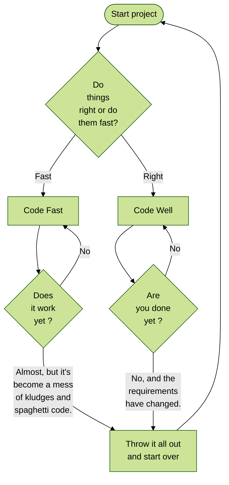
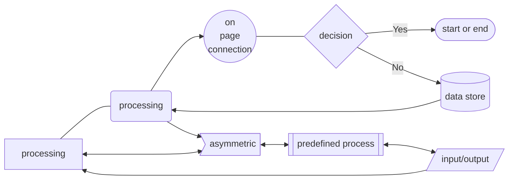

# Mermaid
See [Mermaid syntax](https://mermaid.js.org/intro/syntax-reference.html).

An example, inspired by a [cartoon](https://imgs.xkcd.com/comics/good_code.png) from https://xkcd.com/, ["How to write good code"](https://xkcd.com/844/).

Shapes and lines

## Visual Studio Code
Some hints for VSC use.

To preview on Windows/Linux CTRL+SHIFT+V; on MacOS CMD+SHIFT+P.

To view Mermaid diagrams, install VSC extension Markdown Preview Mermaid Support by bierner.
